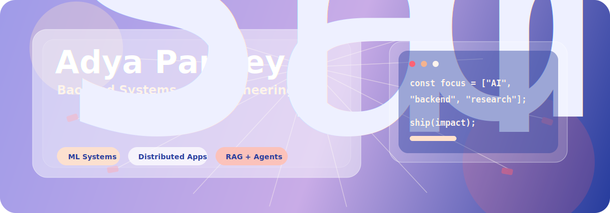
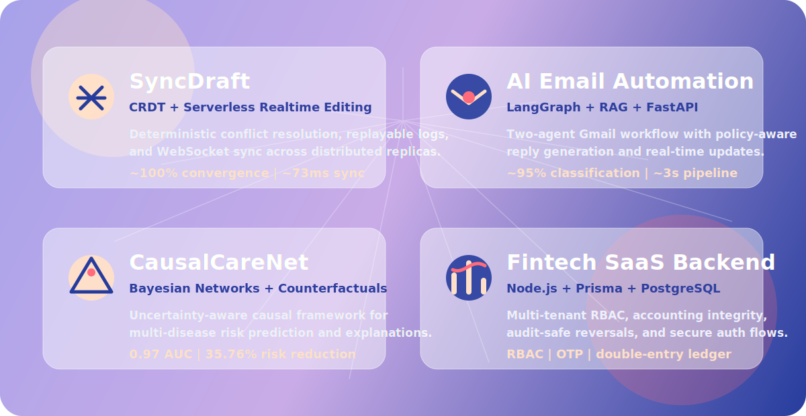
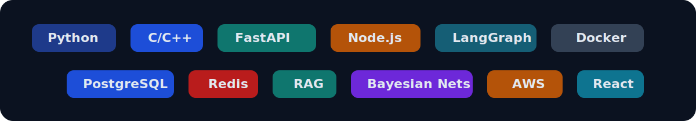
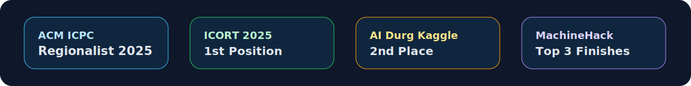

  

 

  
  
  

 

## About Me

I am **Adya Pandey**, a 3rd year **B.Tech Data Science and Artificial Intelligence** student at **IIIT Naya Raipur** with a CGPA of **8.51/10**.

I build backend systems, AI workflows, distributed products, and ML-powered research systems. My work sits around **FastAPI**, **Node.js**, **LangGraph**, **RAG**, **PostgreSQL**, **Redis**, **AWS serverless**, and practical machine learning.

Currently, I am a **Samsung Prism R&D Intern**, researching ML-based prediction of Linux memory page compressibility for ZRAM/ZSWAP optimization.

 

## Featured Projects

  

| Project | Stack | Links |
|---|---|---|
| **SyncDraft** | React, AWS Lambda, DynamoDB, Redis, S3, CRDT | [GitHub](https://github.com/adya07pandey/SyncDraft) · [Live](https://sync-draft.vercel.app) |
| **AI Email Automation System** | FastAPI, LangGraph, LLaMA 3.1, PostgreSQL, Docker | [GitHub](https://github.com/adya07pandey/ReplixAI) · [Live](https://replix-ai-one.vercel.app) |
| **CausalCareNet** | Python, pgmpy, scikit-learn, CatBoost, Bayesian Networks | [GitHub](https://github.com/adya07pandey/CausalCareNet) |
| **Fintech SaaS Backend** | Node.js, Express, Prisma, PostgreSQL, JWT | [GitHub](https://github.com/adya07pandey/Zentra) · [Live](https://zentra-kohl.vercel.app) |

 

## Tech Stack

  

 

## Experience

<table>
  <tr>
    <td width="72">
      
    </td>
    <td>
      <h3>Samsung Prism R&D Intern</h3>
      
<b>Sep 2025 - Present | Remote, India</b>

      
Researching ML-based prediction of memory page compressibility in Linux OS to optimize ZRAM/ZSWAP memory management, targeting high prediction accuracy with minimal CPU and energy overhead.

    </td>
  </tr>
</table>

 

## Achievements

  

 

## GitHub Activity

  
  

 

  

<!--
Quick setup:
1. Put this README.md in a repository named exactly like your GitHub username.
2. Review the imported LinkedIn, GitHub, project, and live links from your resume PDFs.
-->
